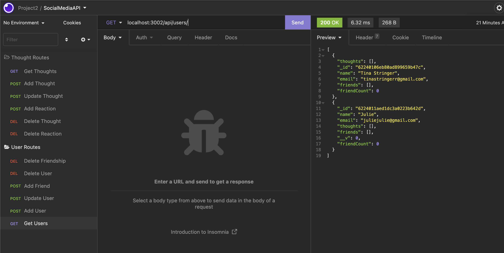

# socialMedia-API

This app is a back end social media API system and allows users to create accounts, delete their account, post thoughts and reaction. The users can have friends, which are other user accounts, and those friendships can be deleted.

In this project express, node, moment, and insomnia were used.
Here's a screenshot and a link to the walkthrough video. I'm still working on the thoughts but in the walkthrough video show the user routes.

https://drive.google.com/file/d/19zRN7CenSEWrIGaqPpocqFPNFJjt582F/view?usp=sharing
